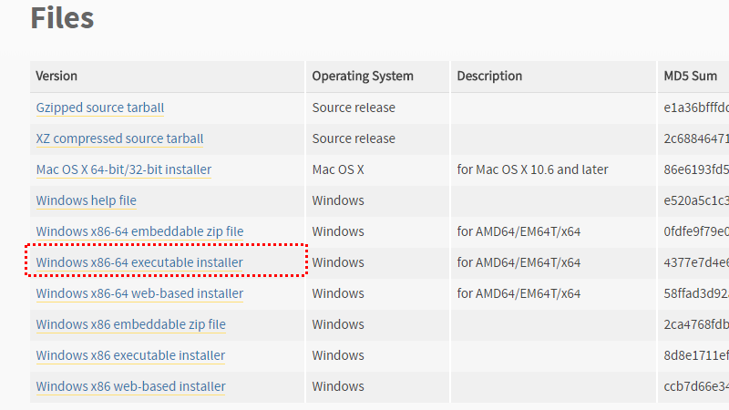
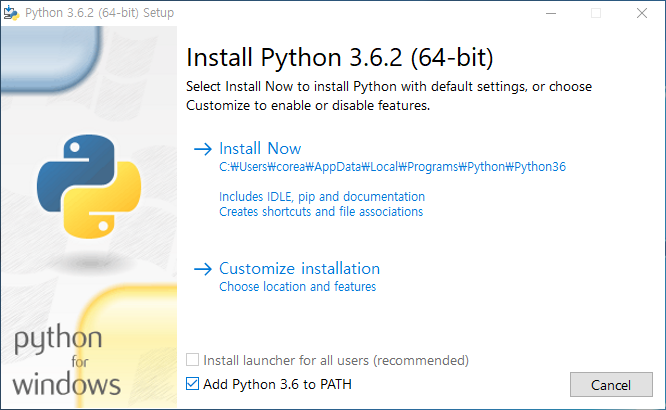
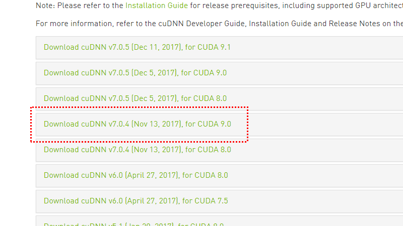
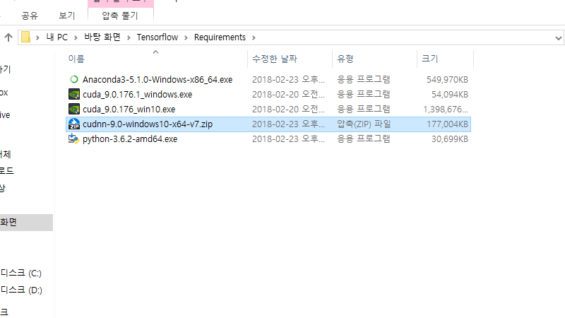
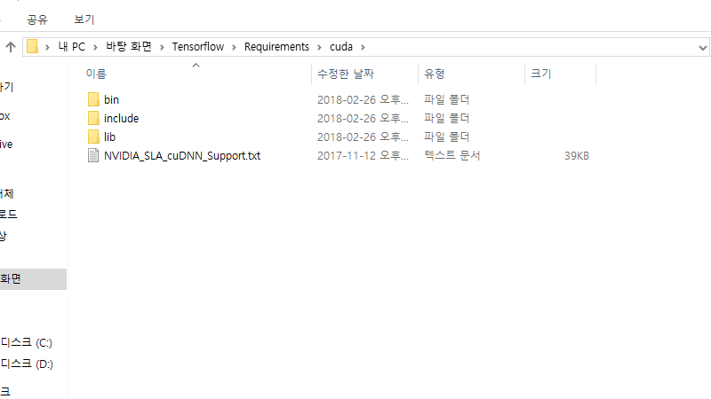
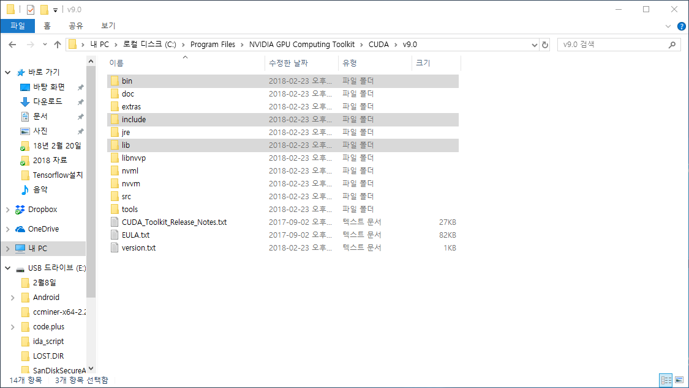
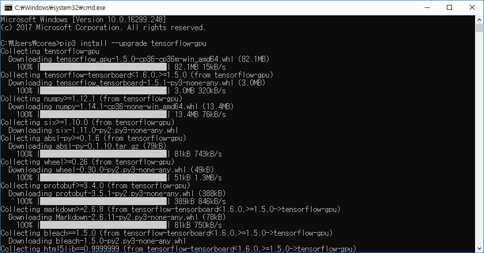
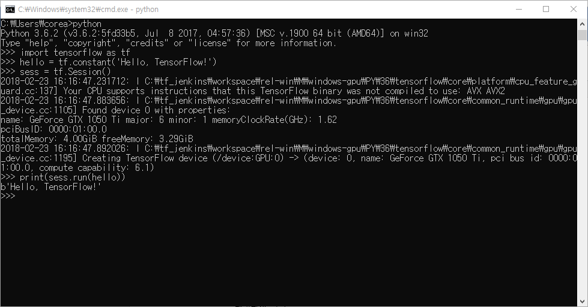

## Installing GPU Version of TensorFlow on Windows

## Test environment
* Windows 10 Enterprise 64bit
* Intel(R) Core(TM) i7-7700 CPU @ 3.60GHz
* RAM 64.0GB
* NVIDA GeForce GTX 1080 Ti


## Requirements
* Python 3.6.2 or Anaconda 5.1
* CUDA® Toolkit 9.0
* cuDNN v7.0
* TensorFlow r1.5

## How to install
### Python
1. Download installer [Python 3.6.2](https://www.python.org/downloads/release/python-362/).





2. Execute downloaded installer.


3. Check "Add Python 3.6 to Path" and click "Insall Now" button.



4. Click "Close" button and finish installation.


### CUDA® Toolkit
1. Download [CUDA Toolkit 9.0](https://developer.nvidia.com/cuda-90-download-archive) that matches your version.


2. Execute downloaded installer.


3. Click "OK" and "Next" to proceed with the installation.


4. Execute patch file.


5. Click "OK" and "Next" to proceed with the installation.


### cuDNN
1. Download [cuDNN](https://developer.nvidia.com/cudnn) Version 7.0.






2. Extract downloaded file and place them in `C:\Program Files\NVIDIA GPU Computing Toolkit\CUDA\v9.0`.





### GPU Version of TensorFlow r1.5 - Python
1. Open command prompt, enter `pip3 install --upgrade tensorflow-gpu` to install TensorFlow.



2. Enter `python` to run `python` and enter the following code to verify installed.



```Python
import tensorflow as tf
hello = tf.constant('Hello, TensorFlow!')
sess = tf.Session()
print(sess.run(hello))
```
